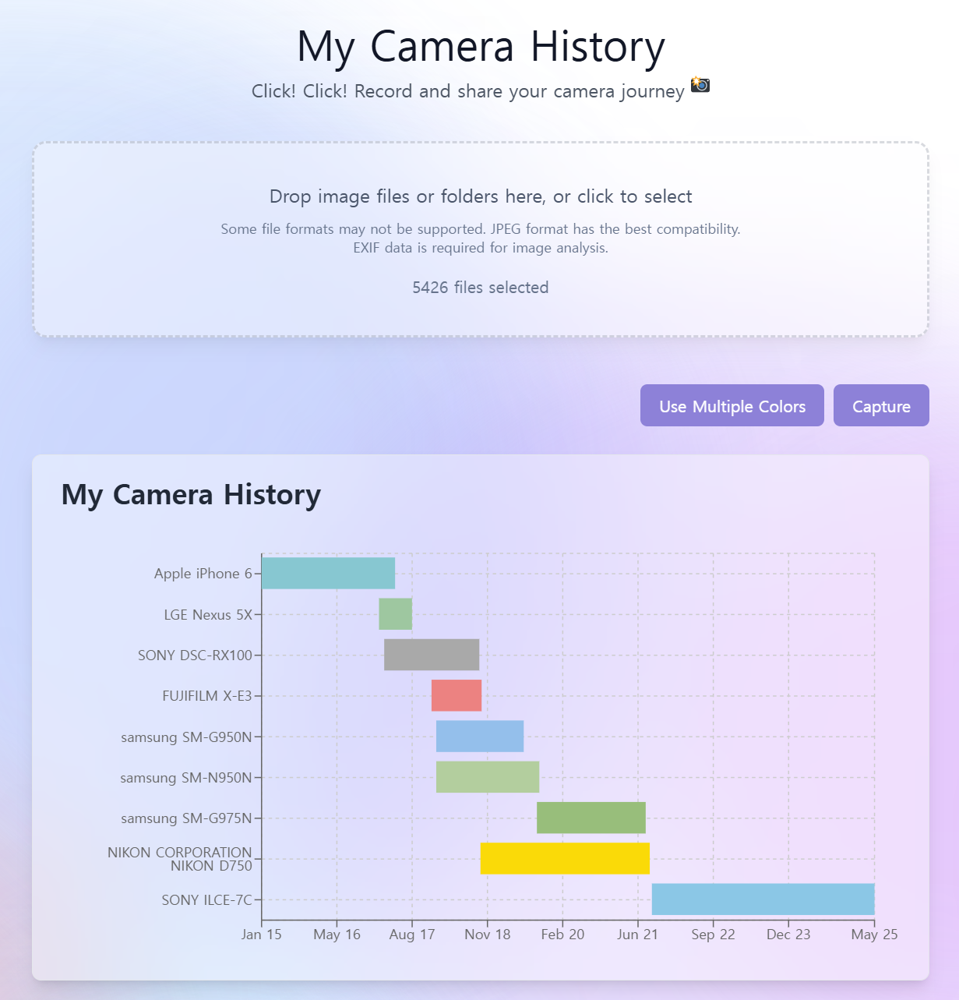

# My Camera History

<p align="center">
  
</p>

## What's This?

My Camera History is an application that allows you to view the cameras you have used over time at a glance and beautifully. **Everything happens right in your browser with no servers involved, your photos and data stay with you, and there's no tracking or analytics.**

### [Try My Camera History in Web Browser](https://newboon.github.io/my-camera-history/)

## Why I Built This

I recently discovered an app called [Snap Scope](https://github.com/Gumball12/snap-scope) in a camera/photography community and was deeply impressed by its convenience, intuitiveness, and aesthetics. (This app is very useful for camera users, so I highly recommend trying it out.) I thought it would be fun to modify this app to create something that allows me to view all the cameras I've used over time at a glance, so I built this.

## Getting Started

You'll need [Node.js@22](https://nodejs.org/) and [PNPM@9.15.3](https://pnpm.io/). We use [Node Corepack](https://nodejs.org/api/corepack.html) to manage PNPM. Check out [package.json](./package.json) for the full setup details.

```bash
# 1. Clone the repository
git clone https://github.com/your-username/my-camera-history.git
cd my-camera-history

# 2. Install dependencies
corepack enable # Enable Corepack
pnpm install

# 3. Start development server
pnpm dev # http://localhost:5173/

# Production build
pnpm build
```

## License

[MIT License](./LICENSE)


